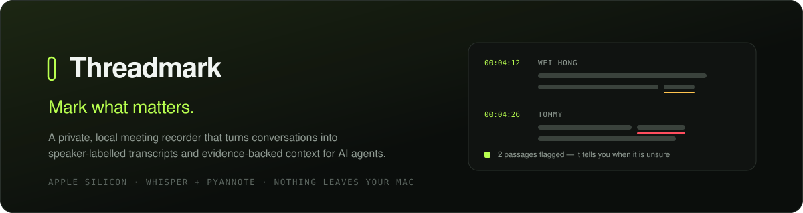

<div align="center">



<br>

**A private, local meeting recorder that turns conversations into speaker-labelled
transcripts and evidence-backed context for AI agents.**

<br>


</div>

---

## The problem

Every AI notetaker hands you a clean-looking transcript with its mistakes buried
invisibly inside. A name is wrong, a figure is off, a sentence was never said —
and it all reads with exactly the same confidence as the parts it got right.

So you either re-listen to the whole recording, or you trust a document you have
no reason to trust.

**Threadmark shows its work.** When it isn't sure, it says so, and shows you
where.

---

## What it does

| | |
|---|---|
| **Transcribes twice** | A fast model gives you live words during the meeting. After you stop, a much stronger model redoes the whole thing from the full recording. |
| **Checks its own work** | It finds the passages it was least sure about and transcribes just those again with more context. If the second attempt is genuinely better, it takes it. If it merely disagrees, it keeps the original and flags it — rather than quietly swapping in a guess. |
| **Marks doubt** | Uncertain words are underlined in the app and wrapped in `⟨?⟩` in the export. You can see at a glance which sentences to verify. |
| **Names the voices** | Speakers are separated automatically. Name them once and Threadmark recognises the same people in future meetings. |
| **Learns your vocabulary** | Names and internal jargon you supply are fed to the model up front and fuzzy-matched afterwards — deliberately cautious, so it won't rewrite an ordinary word into your terminology. |
| **Verifies in seconds** | Click any word to hear that exact moment. The transcript follows along as it plays. Fix something and every export rewrites instantly. |
| **Survives long meetings** | Audio is committed to disk every six seconds. A crash, a closed browser or a killed server costs you nothing. |
| **Never phones home** | No account, no cloud, no per-minute pricing, nothing to leak. |

---

## Context for AI agents

This is the part Threadmark is built around.

Most tools hand an LLM a wall of text and hope. Threadmark produces a structured
briefing where **every extracted claim carries the evidence it came from** — the
speaker, the second it was said, the verbatim quote, how confident the
transcript was there, and whether a human has verified it.

An agent reading this can be held to the record instead of inventing
plausible-sounding conclusions.

Three files come out of every meeting:

```
context.json     structured briefing — decisions, actions, questions,
                 risks, requirements, amounts, each with evidence
context.md       the same thing, readable
transcript.md    the complete record, with uncertainty marked
```

### `context.json`

```jsonc
{
  "schema": "threadmark.context/1",
  "reliability": {
    "mean_word_confidence": 0.89,
    "high_confidence_share": 0.91,
    "passages_rechecked": 10,
    "replaced": 2, "confirmed": 4, "disputed": 4,
    "human_verified_segments": 3,
    "unresolved_review_items": 2
  },
  "participants": [
    { "id": "SPEAKER_00", "name": "Wei Hong", "share": 0.42,
      "seconds": 812.4, "named": true, "voice_match": "confident" }
  ],
  "items": [
    {
      "id": "action-1",
      "type": "action",
      "text": "I'll send Tommy the revised budget before Friday.",
      "speaker": "Wei Hong",
      "owner": "Wei Hong",
      "due": "before Friday",
      "timestamp": "00:12:33",
      "start": 753.2, "end": 757.9, "segment": 41,
      "confidence": 0.94,
      "verified": true,
      "evidence": {
        "quote": "I'll send Tommy the revised budget before Friday.",
        "audio": "recording.wav#t=753.20,757.90"
      }
    }
  ],
  "needs_review": [ /* anything flagged and not yet resolved by a person */ ],
  "usage": {
    "citation_format": "[{timestamp}] {speaker}",
    "rules": [ /* the contract below */ ]
  }
}
```

### The contract it ships with

Both exports carry explicit rules, so the agent's instructions travel with the
data instead of living in your prompt:

> - Cite every claim as `[timestamp] Speaker`.
> - Treat this as evidence of what was said, not as a decision that was ratified.
> - Never present an item with `verified: false` and confidence below 0.55 as
>   fact — say the transcript is unclear there and give the timestamp.
> - An action with owner `unassigned` has no owner in the recording. Do not
>   invent one.
> - Do not answer an open question on the speakers' behalf; surface it as open.
> - When items conflict, prefer the later timestamp and say the record disagrees.

Because each item carries `confidence` and `verified`, an agent can weigh a
claim rather than treating every line as equally true — and `audio` points back
at the exact seconds a human can check.

---

## Install

Requires an Apple Silicon Mac, Python 3.11, and Homebrew FFmpeg.

```bash
brew install ffmpeg
git clone https://github.com/tanueihorng/threadmark.git
cd threadmark
python3.11 -m venv .venv
./.venv/bin/pip install -r requirements.txt
```

Speaker labelling needs one-time access to the pyannote model:

1. Sign in to Hugging Face
2. Accept the conditions for `pyannote/speaker-diarization-community-1`
3. `./.venv/bin/hf auth login`

Whisper models download themselves on first use into `.cache/huggingface`
inside the project.

## Run

```bash
./run.sh
```

Then open <http://127.0.0.1:8765>. Or double-click **Start Threadmark.command**,
which starts the server if it isn't running and opens the page.

> `run.sh` sets `DYLD_LIBRARY_PATH=/opt/homebrew/lib` so TorchCodec can find
> Homebrew's FFmpeg. Without it, speaker labelling fails at the final stage.

---

## How it works

```
browser AudioWorklet — 16 kHz mono PCM
        │  6-second chunks, uploaded independently of transcription
        ▼
recordings/<session>/chunks/          committed to disk immediately
        │
        ├── live    Whisper Small, one second of the previous chunk
        │           prepended for context
        │
        └── on stop
              ①  rebuild the timeline from chunk indices
              ②  Whisper Large-v3-Turbo over the whole recording
              ③  find the passages worth re-checking
              ④  re-transcribe only those, accept or dispute
              ⑤  pyannote — speaker turns and voice embeddings
              ⑥  match voices against known people
              ⑦  align words to speakers, build the review queue
              ⑧  write context.json, context.md, transcript.md
```

### Design decisions worth knowing

**The timeline is rebuilt from chunk indices, not from whatever files exist.**
If an upload is ever lost, plain concatenation would shorten the recording and
silently shift every later word timestamp and speaker turn. Instead, chunk `i`
always starts at `i × 6 s`, and any gap is padded and reported.

**Two confidence thresholds, deliberately.** One decides what gets re-checked
(0.55). A stricter one decides what is visibly marked as doubtful (0.4) — so a
mark means something. Marking everything the model hedges on makes a transcript
unreadable.

**Re-transcription is conservative.** A second pass replaces the original only
when it is measurably more confident. Otherwise the original stands and the
difference is surfaced for a human. The tool is not allowed to quietly overwrite
what was said.

**Vocabulary correction fails safe.** Inventing a correction is worse than
missing one, so ordinary English words are never rewritten and short acronyms
need near-exact matches. `Digibunk → Digibank` fires; `more → MOE` does not.

**Live chunks overlap for context; stored audio does not.** Sentences crossing a
chunk boundary survive, and the final recording has no duplicated audio.

---

## Configuration

Set before recording, in the app:

- **Language** — English, Malay, Mandarin, or auto-detect
- **Final accuracy** — Turbo 4-bit (better) or Small (faster)
- **Meeting vocabulary** — people, projects and terms that will come up
- **Expected speakers** — improves diarization when you know the number
- **Re-check uncertain passages** — the self-correction pass, on by default

Environment:

| Variable | Purpose |
|---|---|
| `THREADMARK_REFINE_MODEL` | Use a different cached MLX model for the re-check pass only. Since just a few short windows are decoded again, a larger model is affordable here even on 8 GB. |

---

## Performance

Measured on an M2 with 8 GB unified memory:

| | |
|---|---|
| Finalization | ≈ 1× real time — a 3-minute recording took 193 s including 10 re-decoded windows and speaker labelling |
| Live latency | Words appear within a few seconds of being spoken |
| Disk | ≈ 115 MB of audio per hour |
| Memory | One model resident at a time — Whisper is released before pyannote loads |

---

## Privacy

Audio, models, transcripts and voice profiles all stay on the machine. There are
no network calls after the models are cached.

`speakers.json` holds voice embeddings — biometric data — and is excluded from
version control, along with `recordings/`, `input/` and `output/`. **Check
`.gitignore` before you push a fork.**

---

## Limitations

- Apple Silicon only
- Processing takes roughly as long as the meeting itself
- Speaker labels arrive after you stop, not live
- No way to browse past meetings in the app yet — they're on disk
- No transcript search
- No summary written in prose: Threadmark extracts and cites, it doesn't paraphrase
- No test suite yet

---

## License

MIT — see [LICENSE](LICENSE).
